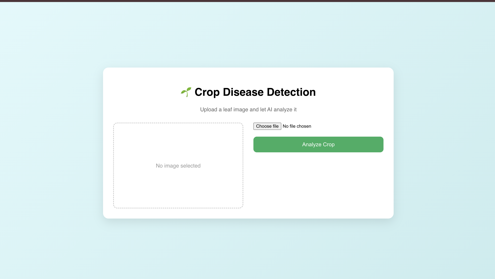
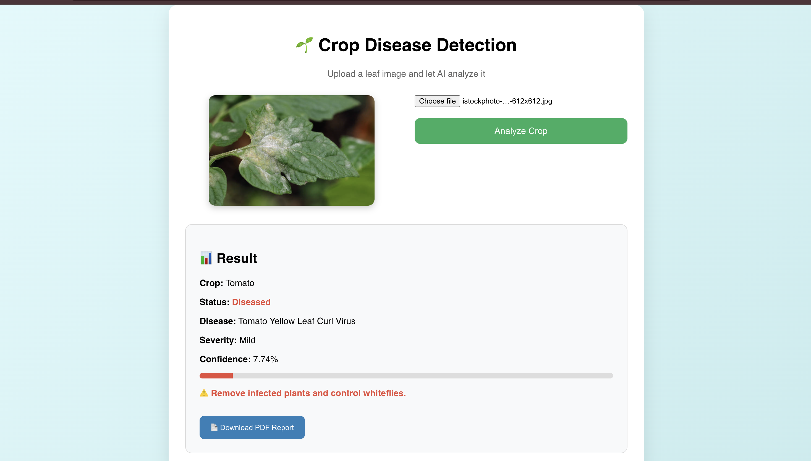
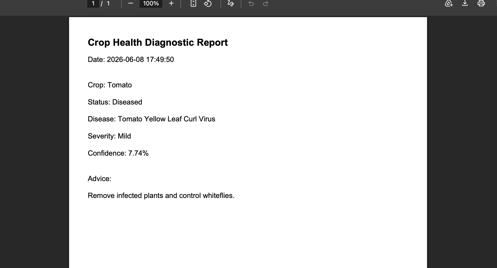

# Crop AI Project

A modern AI-powered Crop Recommendation and Analysis System that helps users make informed agricultural decisions using Machine Learning. The application analyzes crop-related data and provides intelligent recommendations through a simple and user-friendly interface.

## Live Demo

Add your deployment links here:

**Frontend:**  
https://crop-ai-project-sigma.vercel.app/

**Backend:**  
https://crop-ai-project-x41e.onrender.com

## Features

- AI-powered crop recommendations
- Machine Learning prediction system
- User-friendly interface
- Real-time prediction results
- Responsive design
- Agricultural data analysis
- Fast and accurate recommendations
- Clean and modern UI

## Technologies Used

- HTML5
- CSS3
- JavaScript
- Python
- Flask
- TensorFlow
- Keras
- NumPy
- Pandas

## Preview

### Home Page


### Prediction Page


### Result Page


## 📂 Project Structure

```text
crop-ai-project/
├── frontend/
│   ├── index.html
│   ├── style.css
│   └── script.js
│
├── backend/
│   ├── app.py
│   ├── requirements.txt
│   └── model/
│
├── screenshots/
│   ├── home.png
│   ├── prediction.png
│   └── result.png
│
└── README.md
```

## Features Overview

### Crop Analysis
- Analyze agricultural inputs
- Generate crop recommendations
- Provide prediction insights

### AI Prediction System
- Machine Learning model integration
- Fast prediction results
- Accurate recommendations

### User Experience
- Responsive dashboard
- Easy navigation
- Clean interface design

## Learning Outcomes

Through this project, I learned:

- Machine Learning Fundamentals
- TensorFlow & Keras
- Model Training and Evaluation
- Flask Backend Development
- API Integration
- Data Preprocessing
- Responsive Web Development
- AI Model Deployment


## Future Enhancements

- Crop Disease Detection
- Weather Forecast Integration
- Fertilizer Recommendation System
- Soil Analysis Module
- Multi-language Support
- Mobile Application
- Advanced Analytics Dashboard
- Cloud-Based Model Retraining

